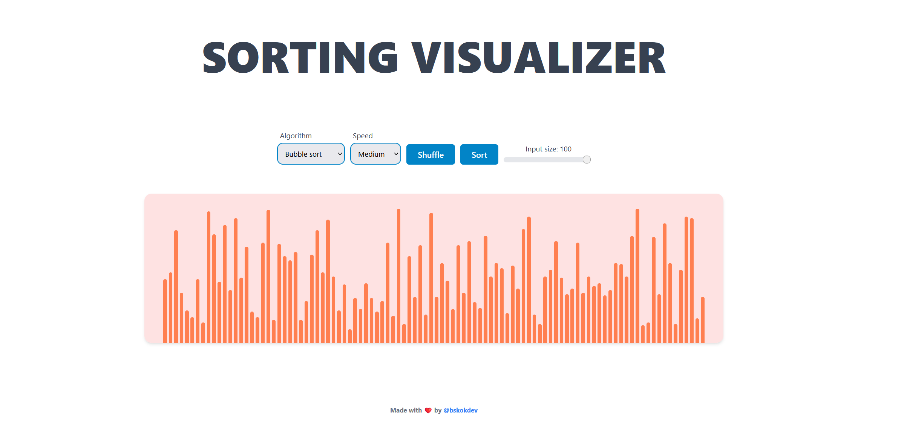

# Sorting visualizer

## [Live demo](https://imaginative-heliotrope-23d9ce.netlify.app/)

### This project allows you to visualize a few sorting algorithms in various speeds (slow, medium, fast) on 1-100 input size

### Algorithms included

- Bubble sort - O(n^2)
- Insertion sort - O(n^2)
- Selection sort - O(n^2)
- Quick sort - O(n log n)
- Heap sort - O(n log n)

#### See the example down below.

#### How to run locally

- Clone this repository
- Make sure you have pnpm installed
- Run `pnpm install`
- Run `pnpm dev`

## Technologies used:

- Typescript
- React
- React hooks
- Tailwind
- Sorting Algorithms
